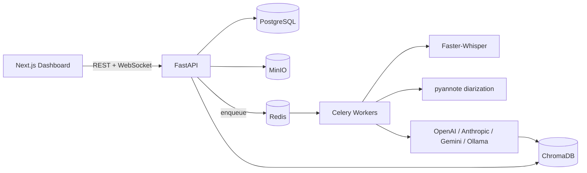

<div align="center">



<br/>


[](LICENSE)
[](backend/pyproject.toml)
[](frontend/package.json)
[](docker-compose.yml)
[](CONTRIBUTING.md)

**A research-grade, production-ready speech intelligence platform** — real-time
transcription, speaker diarization, emotion detection, voice biometrics,
meeting & podcast intelligence, RAG over your own voice memory, and a
multi-agent voice assistant, all running locally or in your own cloud.

[Quick Start](#quick-start) · [Features](#features) · [Architecture](#architecture) · [Docs](docs/) · [Roadmap](#roadmap)

</div>

---

## Why this exists

Most "speech-to-text demo" repos stop at calling a transcription API and
printing the result. This project is the rest of the stack: turning raw
audio into a searchable, queryable, continuously-growing personal knowledge
base — with the speaker-diarization, emotion, summarization, and retrieval
layers that make a transcript actually *useful* the day after you recorded
it, not just a wall of text.

It's built to be your **daily-use assistant** — record meetings, classes,
interviews, and voice notes; ask it weeks later what you discussed; have it
summarize, translate, and act on voice commands — while staying fully
self-hostable with zero mandatory cloud dependencies (the default LLM
provider is a local Ollama model).

## Features

### Core speech recognition
- Real-time **streaming transcription** over WebSocket (VAD-gated, Faster-Whisper backend)
- Offline batch transcription for uploaded recordings
- Multi-language transcription with automatic language detection
- Noise-robust preprocessing pipeline (spectral-gating denoise, peak normalization)

### Advanced intelligence
- **Speaker diarization** ("who spoke when") via pyannote.audio
- **Voice biometrics** — enroll known speakers, auto-identify them across future recordings
- **Emotion detection** — happy / sad / angry / fear / neutral / excited, from a wav2vec2 SER model + an arousal heuristic
- **Meeting Intelligence** — auto-generated minutes, decisions, and structured action items
- **Podcast Intelligence** — auto-generated chapters, highlights, and keywords
- **RAG over your voice memory** — "What did I discuss last week about machine learning?", answered from your own transcripts, with citations
- **Multi-agent AI assistant** — six specialist agents (speech/voice-commands, search, translation, summarization, memory, general assistant) routed by a lightweight orchestrator
- **Live translation** — English, Hindi, Bengali, Spanish, French, German, Japanese out of the box
- **Voice commands** — "open Chrome", "open folder X", "search for Y" — opt-in, local-machine only
- **Wake word framework** ("Hey Aranya") via openWakeWord — bring your own trained model
- **Speech Analytics Dashboard** — speaking rate, silence ratio, emotion trends, speaker balance

### Engineering
- **Plugin architecture for LLMs** — OpenAI, Anthropic, Gemini, or fully local via Ollama, swappable with one config line
- **Plugin architecture for every ML capability** — ASR, diarization, emotion, embeddings, and the vector store are each behind a narrow interface (see [`docs/architecture.md`](docs/architecture.md))
- Async FastAPI + Celery for anything CPU/GPU-bound, so the API never blocks
- JWT auth with RBAC, Postgres + ChromaDB + MinIO + Redis, full Docker Compose stack
- Prometheus + Grafana observability, GitHub Actions CI/CD, CodeQL scanning
- pytest suite (unit + integration) mocking the ML/storage boundary — fast, deterministic, no GPU required to run CI

## Screenshots

> Replace these placeholders with real screenshots once you've run the app —
> see `.github/assets/`.

| Live Capture | Assistant | Analytics |
|---|---|---|
| `docs/screenshots/dashboard.png` | `docs/screenshots/assistant.png` | `docs/screenshots/analytics.png` |

## Architecture



Full diagrams (high/low-level design, data flow, sequence diagrams, DB
schema) live in [`docs/architecture.md`](docs/architecture.md).

## Tech Stack

| Layer | Technology |
|---|---|
| Backend | Python 3.11, FastAPI, SQLAlchemy 2 (async), Alembic |
| Frontend | Next.js 15, React 19, TypeScript, Tailwind CSS |
| Database | PostgreSQL 16 |
| Vector store | ChromaDB (FAISS included as a swappable alternative) |
| Cache / Queue | Redis, Celery |
| Object storage | MinIO (S3-compatible) |
| ASR | Faster-Whisper (Whisper large-v3 via CTranslate2) |
| Diarization | pyannote.audio 3.1 |
| Speaker embeddings | SpeechBrain ECAPA-TDNN (VoxCeleb-pretrained) |
| Emotion | wav2vec2 SER (SUPERB) |
| LLM orchestration | LangChain / LlamaIndex primitives, custom plugin layer |
| Monitoring | Prometheus, Grafana |
| Containerization | Docker, Docker Compose |
| CI/CD | GitHub Actions, CodeQL |

## Quick Start

```bash
git clone https://github.com/your-username/speech-recognition-ai.git
cd speech-recognition-ai
cp .env.example .env
./scripts/setup.sh
```

Then open **http://localhost:3000**. Full walkthrough in
[`docs/installation.md`](docs/installation.md).

## Usage

```bash
# Upload a recording
curl -X POST http://localhost:8000/api/v1/recordings/upload \
  -H "Authorization: Bearer $TOKEN" \
  -F "file=@meeting.wav" -F "title=Q3 Planning" -F "kind=meeting"

# Ask your voice memory a question
curl -X POST http://localhost:8000/api/v1/search/ask \
  -H "Authorization: Bearer $TOKEN" \
  -H "Content-Type: application/json" \
  -d '{"query": "What did I decide about the roadmap last week?"}'
```

More examples in [`docs/user-guide.md`](docs/user-guide.md). Full endpoint
reference in [`docs/api-reference.md`](docs/api-reference.md), or browse
the live Swagger UI at `/api/docs` once running.

## Datasets

This project needs **no dataset download for normal use** — bring your own
audio. Datasets (LibriSpeech, Common Voice, VoxCeleb, TED-LIUM, AMI Meeting
Corpus, VoxPopuli, IEMOCAP, CREMA-D) are only relevant if you want to
fine-tune or benchmark a component — see [`datasets/README.md`](datasets/README.md)
for download links, sizes, licenses, and folder placement for each.

## Testing

```bash
make test          # in Docker
make test-local     # local Python env
```

The suite mocks the ML/storage boundary (no multi-GB model downloads in
CI) — see `backend/tests/conftest.py`. Run `make lint` for `ruff` + `black`
+ `next lint`.

## Roadmap

- [ ] pgvector option for Postgres-native vector search (alternative to ChromaDB for single-datastore deployments)
- [ ] Streaming (token-by-token) LLM responses in the Assistant panel
- [ ] Server-side analytics rollup endpoint (currently the Analytics dashboard charts are UI-reference seeded data — see `docs/user-guide.md`)
- [ ] Mobile-responsive Live Capture flow
- [ ] Built-in TTS backend (Piper/Coqui) wired to the translation pipeline for true speech-to-speech
- [ ] Multi-hop agent planning (the orchestrator already supports chaining; no agent currently needs more than one hop)
- [ ] pgvector / Pinecone adapters demonstrating the vector-store plugin boundary with a second real backend

Contributions toward any of these (or your own ideas) are very welcome —
see [`CONTRIBUTING.md`](CONTRIBUTING.md).

## Why MIT?

MIT was chosen to maximize this project's usefulness as a reference
implementation and starting point — for portfolios, internal tools, or
products — with the fewest possible obligations on anyone building on it.
Copyleft licenses (GPL/AGPL) would discourage commercial/internal adoption
where some of the bundled models (pyannote, in particular) already carry
their own usage terms that deployers need to evaluate independently; adding
a second layer of license friction on top of the codebase itself wasn't
worth the tradeoff for a project meant to be widely reused and learned
from.

## Contributors

Contributions of all kinds are welcome — see [`CONTRIBUTING.md`](CONTRIBUTING.md)
for setup instructions, the plugin-extension guides (new LLM providers, new
agents), and code style. Please also read [`CODE_OF_CONDUCT.md`](CODE_OF_CONDUCT.md).

## License

[MIT](LICENSE) © 2026 Speech Recognition AI Contributors
